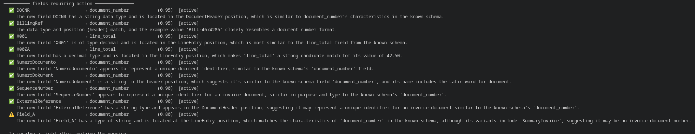
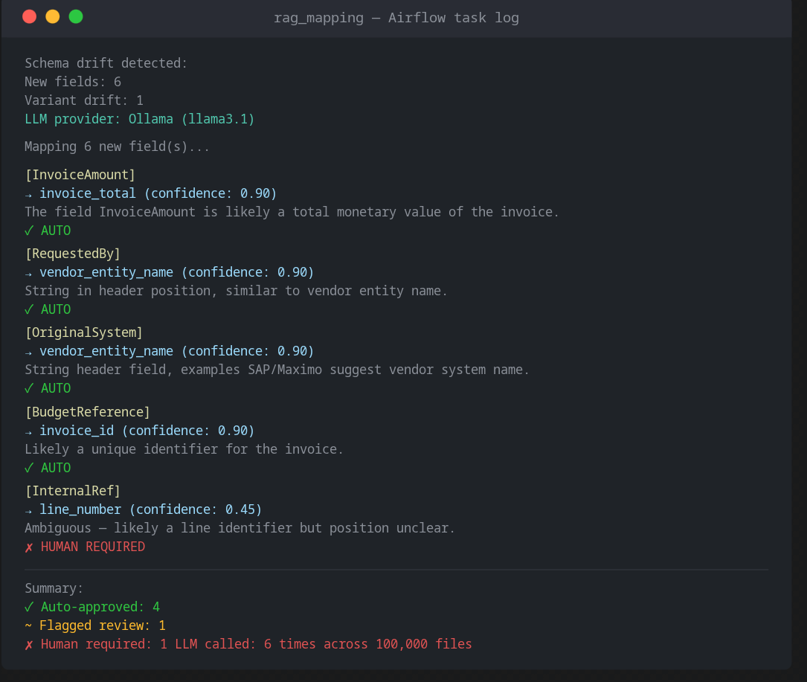
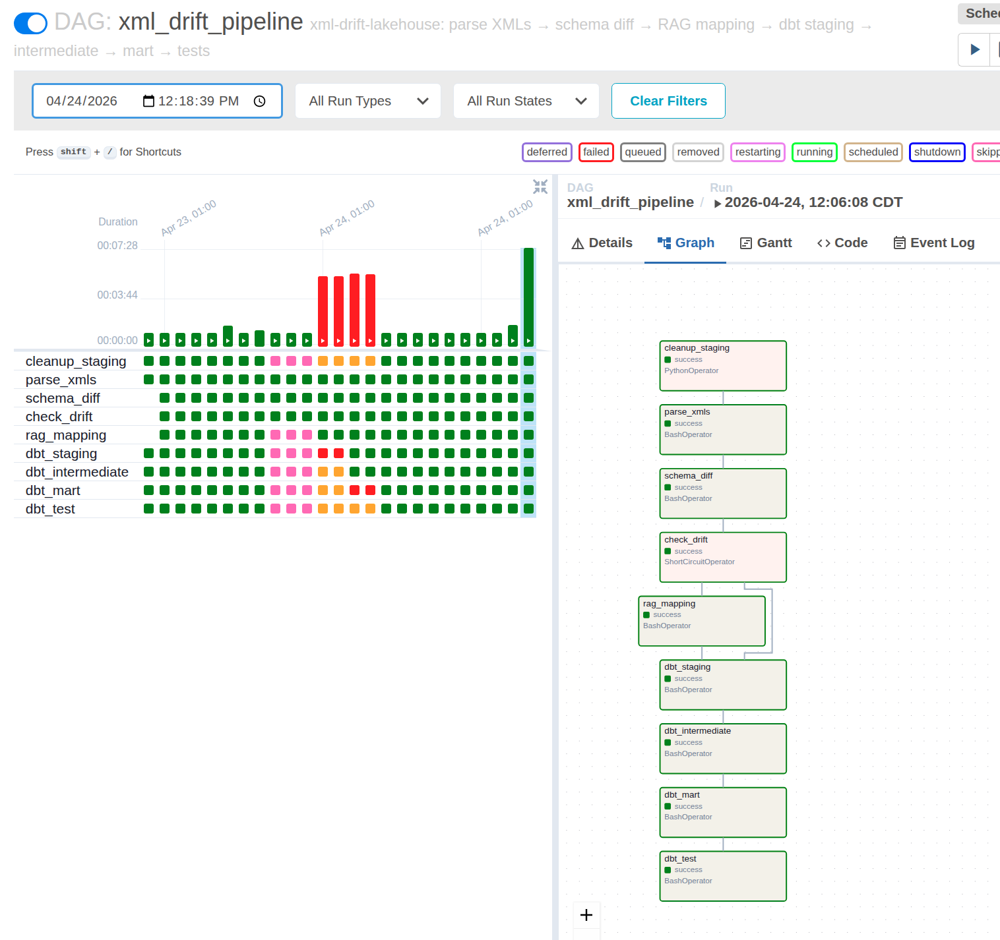

# xml-drift-lakehouse


> Work in progress. The architecture, patterns and folder structure are documented and reflect real production experience. Implementation is being built incrementally. Feedback and contributions welcome.

A production-grade, schema-on-read XML ingestion toolkit with automated structural drift detection and AI-assisted field mapping.

Built as a portfolio project to demonstrate real-world data engineering patterns: immutable raw storage, replayable transformations, and an LLM-assisted pipeline that handles schema evolution without manual intervention.

---

## Contents

- [Benchmark](#benchmark)
- [The Problem](#the-problem)
- [The Approach](#the-approach)
- [Architecture](#architecture)
- [XML Variants](#xml-variants)
- [Phase 2 in Action](#phase-2-in-action--real-run-output)
- [AI Stress Test](#ai-stress-test--how-far-can-the-llm-go)
- [Mapping Registry](#mapping-registry)
- [Resolving Drift](#resolving-drift)
- [Customizing the Baseline](#customizing-the-baseline)
- [Local Stack](#local-stack)
- [Repository Structure](#repository-structure)
- [Quickstart](#quickstart)
- [dbt Lineage](#dbt-lineage)
- [Sample Data](#sample-data)
- [Testing Drift Detection](#testing-drift-detection)
- [Roadmap](#roadmap)
- [Background](#background)
- [AI Assistance](#ai-assistance)

---

### Benchmark

Tested on a standard Linux workstation (32GB RAM, 8GB GPU, SSD), no cloud dependencies. GPU used by Ollama for LLM inference during drift mapping; the pipeline itself runs entirely on CPU.

| Dataset | Files | Line Items | Duration | dbt Tests |
|---------|-------|------------|----------|-----------|
| Sample  | 10 | ~53 | ~5s | 51/51 ✅ |
| Standard | 3,000 | 16,151 | 96s | 51/51 ✅ |
| Stress | 100,000 | 549,938 | 7m 28s | 51/51 ✅ |

Half a million rows reconciled across two structural XML variants, fully tested, on a local stack. No cloud required.

On the stress run with 5% drift (~5,000 files containing unknown fields), the LLM was called **6 times** — once per unique unknown field discovered, not once per file. The system identifies all occurrences of a new field across the entire dataset in a single schema diff pass, then makes one mapping decision per field. This keeps LLM costs and latency negligible regardless of dataset size.

---

## The Problem

Most XML ingestion tools assume a stable, known schema. Real-world XML does not behave that way.

Over years of production use, XML sources accumulate:
- Field names that changed between versions
- Node structures that appear as scalars in some records and arrays in others
- Optional elements that are present in some variants and absent in others
- Hierarchical paths that reorganized across system upgrades

Hard-coding a schema against drifted XML means constant maintenance, silent data loss, or pipeline failures. This toolkit takes a different approach.

---

## The Approach

**Schema-on-read with surrogate key propagation.**

Instead of defining what the XML should look like, the pipeline discovers what it actually looks like at ingestion time. Each structural variant is absorbed automatically and reconciled at the analytical layer.

Key patterns:

- **Schema-on-read ingestion** — no hard-coded field mapping at the ingestion stage
- **Surrogate key injection** — a deterministic SHA-256 key is injected at ingestion and propagated through all child records to maintain join integrity across entities
- **Relational explosion** — hierarchical XML nodes are flattened into separate tables preserving parent-child relationships
- **Variant reconciliation** — multiple structural variants of the same entity are unified at the analytical layer via UNION ALL and COALESCE across divergent field names
- **Defensive casting** — CAST/COALESCE/NULLIF patterns handle empty strings, null fields, and type mismatches across variants
- **LLM-assisted drift mapping** — new or unknown fields are mapped to the known schema by sending the full field corpus directly in the LLM prompt, with confidence-tiered routing to auto-approve, human review, or pipeline pause. The architecture is designed to support a full RAG implementation (local vector store + semantic retrieval) as a drop-in upgrade — not included here to keep the stack lightweight and dependency-free

---

## Architecture

```
XML Source
    |
    v
[ Ingestion Layer ]
  - XML parsed via lxml
  - Surrogate key injected (SHA-256 of source_file + invoice_id)
  - Stored as Parquet in landing zone
    |
    v
[ Schema Diff ]
  - Today's observed schema compared against known baseline
  - New fields, variant drift, type conflicts detected
  - diff.json + diff.md written for audit trail
    |
    v
[ LLM Field Mapping ]  ← only fires if drift detected
  - Full schema corpus injected into LLM prompt
  - LLM suggests mapping + confidence + reasoning
  - Vector store retrieval (true RAG) ready as drop-in upgrade
  - New fields sent to LLM with full schema context
  - Confidence-tiered routing:
      ≥ 0.90  auto_approved  → pipeline continues
      ≥ 0.70  flagged_review → pipeline continues, flag logged
      < 0.70  pending_human  → logged, awaits human decision
  - All decisions written to mapping_registry (DuckDB)
    |
    v
[ Relational Layer ]
  - Hierarchical nodes exploded into tables
  - Parent-child joins via surrogate key
  - Both variants handled transparently
    |
    v
[ Reconciliation Layer ]
  - Variant UNION ALL with COALESCE on divergent fields
  - Deduplication: latest status wins per invoice + line
  - Defensive type casting
  - Consumer-ready analytical table
    |
    v
[ Analytics ]
  - Clean, queryable DuckDB table
  - BI / reporting ready
```

### Why partitioned final output?

Each run produces an isolated partition (`dt=2026-04-24/`). If a mapping decision was wrong:

1. Delete only that partition: `rm -rf output/final/dt=2026-04-24/`
2. Correct the mapping in `mapping_registry`
3. Re-run dbt for that date only
4. All other partitions untouched

This is the lakehouse principle: raw data is immutable, transformations are replayable, no full reprocessing needed.

---

## XML Variants

The dataset contains two structurally distinct invoice types, both handled transparently by the pipeline:

| Feature | DetailedInvoice | SummaryInvoice |
|---------|----------------|----------------|
| Distribution | ~60% of test dataset | ~40% of test dataset |
| Line items | Full unit economics | Lean |
| ProductDescription / ServiceCode | Yes | No |
| LineSubTotal / LinePretaxTotal | Yes | No |
| Allocation position | Inside each LineEntry | Header level |
| PeriodDate | Line level | Header level |
| Tax entries | Yes (sparse) | No |
| Early payment terms | Yes (sparse) | No |

The reconciliation logic uses `COALESCE` across variants in the mart layer — the same pattern used in the production Athena views this project is based on.

---

## Phase 2 in Action — Real Run Output

Schema drift detected on a live run with 3,000 AI-generated XML files:

```
⚠️  Schema drift detected:
  New fields:    5
  Variant drift: 1
  Type conflicts: 0
  → RAG mapper will be triggered
```

The 5 unknown fields included both a deliberately injected test field (`InvoiceAmount`) and 4 fields already present in the XML feed but not covered by the baseline (`Initial`, `RequestedBy`, `Date`, `OrderLineRef`). The system found all of them in one pass.

We ran the same drift against both supported LLM providers on the same data, changing only `LLM_PROVIDER` in `.env`. No other modifications.

### Ollama (llama3.1) — tries harder, more willing to commit

```
[InvoiceAmount]  → line_total          (0.80)  ⚠️  REVIEW
[Initial]        → vendor_total        (0.50)  🛑 HUMAN REQUIRED
[RequestedBy]    → vendor_entity_name  (0.80)  ⚠️  REVIEW
[Date]           → document_date       (0.85)  ⚠️  REVIEW
[OrderLineRef]   → alloc_total         (0.81)  ⚠️  REVIEW

✅ Auto-approved: 0  |  ⚠️ Flagged review: 4  |  🛑 Human required: 1  |  ❓ Unknown: 0
```

### Claude (claude-haiku) — more conservative, more honest

```
[InvoiceAmount]  → UNKNOWN             (0.00)  🛑 HUMAN REQUIRED
  "Position is 'Party' — doesn't match header/line/allocation.
   Can't map despite name similarity to invoice_total."

[Initial]        → UNKNOWN             (0.00)  🛑 HUMAN REQUIRED
  "Single-character string at Contact/ActionSource position.
   No standard invoice field matches this pattern."

[RequestedBy]    → UNKNOWN             (0.00)  🛑 HUMAN REQUIRED
  "Person name (e.g. 'Martin, Shaun') at LineEntry position.
   Schema has no requester/person field at line level."

[Date]           → document_date       (0.82)  ⚠️  REVIEW
  "Date type with generic name in CrossReference position —
   aligns with document_date as the primary invoice date."

[OrderLineRef]   → line_number         (0.75)  ⚠️  REVIEW
  "Integer with examples 218, 973 — likely a line item reference,
   similar to line_number which sequentially identifies lines."

✅ Auto-approved: 0  |  ⚠️ Flagged review: 2  |  🛑 Human required: 3  |  ❓ Unknown: 3
```

### What this comparison shows

| Field | Ollama | Claude | Who's right? |
|-------|--------|--------|--------------|
| `InvoiceAmount` | `line_total` 0.80 | UNKNOWN | **Claude** — field is in a `Party` node, not a financial total |
| `Initial` | `vendor_total` 0.50 | UNKNOWN | **Claude** — it's a contact initial, not an amount |
| `RequestedBy` | `vendor_entity_name` 0.80 | UNKNOWN | **Claude** — person name at line level, no match in schema |
| `Date` | `document_date` 0.85 | `document_date` 0.82 | **Both agree** |
| `OrderLineRef` | `alloc_total` 0.81 | `line_number` 0.75 | **Claude** — integer reference maps better to line_number |

**Claude is more conservative and structurally precise.** Where Ollama forced a mapping, Claude cited the position mismatch and refused to guess. A wrong auto-mapping that passes review is worse than a human flag that gets resolved correctly.

**Ollama is more aggressive.** It found a candidate for every field (zero unknowns), which means fewer human reviews — but at the cost of questionable mappings like `Initial` → `vendor_total`.

Neither is universally better. The right choice depends on your tolerance for false positives vs false negatives:
- **Ollama**: fewer human interruptions, higher risk of silent wrong mappings
- **Claude**: more human reviews on genuinely ambiguous fields, lower risk of wrong auto-approvals

---

## AI Stress Test — How Far Can the LLM Go?

To understand the real limits of the field mapper, we ran a progressive stress test against `document_number` — replacing the field name with increasingly distant alternatives across language, abbreviation, ambiguity, position, and type dimensions.

| Field | Type | Position | Mapped To | Confidence | Notes |
|-------|------|----------|-----------|------------|-------|
| `NumeroDocumento` | string | header | `document_number` | 0.90 | Italian — semantic meaning recognized |
| `NumeroDokument` | string | header | `document_number` | 0.90 | German — fell back to "Latin word for document" |
| `DOCNR` | string | header | `document_number` | 0.95 | Abbreviation — position + type sufficient |
| `BillingRef` | string | header | `document_number` | 0.95 | Value `BILL-4674286` used as evidence |
| `SequenceNumber` | string | header | `document_number` | 0.90 | Misleading name — position anchor held |
| `ExternalReference` | string | header | `document_number` | 0.90 | Genuinely ambiguous — overconfident |
| `Field_A` | string | header | `document_number` | 0.90 | Opaque name — position anchor held |
| `Field_A` | string | **line** | `document_number` | **0.80** | Position change → confidence drop → `flagged_review` |
| `X001` | string | line | `document_number` | 0.80 | Opaque + wrong position — still maps |
| `X001` | **float** | line | `line_total` | **0.95** | Type change → completely different mapping |



### Key findings

**Type is the strongest signal.** Changing the data type from string to float caused a complete mapping flip — from `document_number` to `line_total` with 0.95 confidence. The LLM never needed the field name to reach high confidence.

**Position is the second strongest signal.** Moving a field from header to line dropped confidence from 0.90 to 0.80, correctly routing `Field_A` and `X001` to `flagged_review` rather than auto-approve.

**Field name is the weakest signal.** The LLM reached 0.90 on completely opaque names (`Field_A`, `X001`) using position and type alone. Foreign language names and abbreviations made no difference to the final confidence score.

**Value is used when available.** For `BillingRef`, the LLM cited the example value `BILL-4674286` as evidence. This is only possible because the schema diff passes the first observed value to the prompt.

### Prompt engineering considerations

The current prompt instructs the LLM to consider abbreviations, data type compatibility, and position. The stress tests revealed that the LLM relies too heavily on type and position, often reaching 0.90 confidence even for completely opaque or genuinely ambiguous field names.

This is acceptable for a development environment but has implications for production:

- `ExternalReference` mapped to `document_number` at 0.90 — but it could legitimately be a PO number, contract reference, or cross-system ID
- `Field_A` should never auto-approve at 0.90 — an opaque name with no semantic signal warrants human review regardless of position

**Suggested improvement:** Force explicit reasoning order — name → type → position → value — and require the LLM to explicitly penalize confidence when the field name provides no semantic signal. The confidence thresholds (`CONFIDENCE_AUTO=0.90`, `CONFIDENCE_REVIEW=0.70`) should be tuned based on prompt quality and use-case risk tolerance before moving to production.

---

## Mapping Registry

Every decision is written to `mapping_registry` in DuckDB:

```sql
SELECT source_field, mapped_to, decision_type, confidence, llm_reasoning
FROM mapping_registry
WHERE run_date = '2026-04-24'
ORDER BY confidence DESC;
```

To correct a wrong mapping:

```sql
UPDATE mapping_registry
SET    status        = 'overridden',
       mapped_to     = 'invoice_total',
       overridden_by = 'manual: InvoiceAmount is header total, not line total'
WHERE  source_field = 'InvoiceAmount'
AND    run_date     = '2026-04-24';
```

Then delete the affected partition and re-run dbt. Raw data unchanged.

---

## Resolving Drift

When `verify.py` reports open fields in the mapping registry, follow these three steps:

### 1. Add the field to the baseline

Open `ingestion/schema_diff.py` and add the new field to `BASELINE_FIELDS`:

```python
"DocumentNbr": {"type": "string", "position": "header", "variants": ["both"], "description": "Vendor abbreviation for DocumentNumber"},
```

### 2. Add an alias in the parser

Open `ingestion/parser.py` and add the field as a fallback in the relevant extraction line:

```python
document_number = get(header, "DocumentNumber") or get(header, "DocumentNbr") or get(header, "DocNumber")
```

### 3. Mark the field as resolved

```bash
python verify.py --resolve DocumentNbr
```

Then re-run the DAG to confirm no drift remains. `verify.py` will show `Resolved: N` and `Open: 0`.

---
## Customizing the Baseline

The baseline is the `BASELINE_FIELDS` dictionary in `ingestion/schema_diff.py`. It defines what the pipeline considers a known, expected field. Anything not in this dictionary is treated as drift and routed to the field mapper.

The baseline shipped with this repo was built from hands-on experience with real invoice XML feeds. It covers the field set most commonly found in vendor billing documents: header fields (document identifiers, dates, amounts, vendor info, contact details), line fields (quantities, prices, service codes, categories), and allocation fields (cost centers, project codes, account codes). It is a solid starting point for any invoice-style XML feed, but it will need to be adapted to your specific source system and vendor agreements.

**Adapting the baseline to your feed:**

Open `ingestion/schema_diff.py` and edit `BASELINE_FIELDS` directly. For each field you want to declare as known:

```python
"YourFieldName": {
    "type":        "string",       # string, decimal, integer, date, datetime
    "position":    "header",       # header, line, allocation
    "variants":    ["both"],       # ["both"], ["DetailedInvoice"], ["SummaryInvoice"]
    "description": "What this field contains"
},
```

Run the pipeline once against a sample of your files. Any field not in the dictionary will appear in `diff.json` and be routed to the field mapper. Review the results, confirm the mappings, add the confirmed fields to `BASELINE_FIELDS`, and commit. That is your baseline.

**What rag_mapper.py actually does:**

`rag_mapper.py` is a suggestion engine, not an automatic mapper. It detects unknown fields, asks the LLM what they likely correspond to in the known schema, scores the confidence, and records the decision in `mapping_registry`. It does not automatically apply the mapping to the parser or transformation layer — that step requires a human decision.

The `mapping_registry` entry tells you: "this new XML field name probably represents this known concept." For example:

```
DocumentNbr → invoice_id   (flagged_review, 0.90)
```

This means: the LLM thinks `DocumentNbr` in the XML is the same concept as `invoice_id` in the output schema — likely a vendor abbreviation of `DocumentNumber`.

**Applying a confirmed mapping — the human workflow:**

When you agree with a mapping decision, there are two things to do:

1. **Add the field to `BASELINE_FIELDS`** in `ingestion/schema_diff.py` so it is no longer detected as drift:

```python
"DocumentNbr": {
    "type":        "string",
    "position":    "header",
    "variants":    ["both"],
    "description": "Vendor abbreviation for DocumentNumber"
},
```

2. **Add an alias in `ingestion/parser.py`** so the parser reads `DocumentNbr` as `DocumentNumber` at ingestion time. Find the line where `invoice_id` is assigned in `extract_header` and extend it with an `or` fallback:

```python
# Before
invoice_id = get(header, "DocumentNumber")

# After
invoice_id = get(header, "DocumentNumber") or get(header, "DocumentNbr")
```

The `get()` function returns `None` if the field is not found, so the `or` chain tries `DocumentNumber` first and falls back to `DocumentNbr` if it is missing. Add one `or get(header, "...")` per alias you need to support.

3. **Re-run the pipeline** — `DocumentNbr` is now known, no drift triggered, the field is correctly parsed and flows through dbt as `invoice_id`.

4. **Commit both files** — the baseline and the parser update are the permanent record of this decision. The `mapping_registry` entry remains as the audit trail of how the decision was reached.

This keeps every mapping change under version control, human-approved, and traceable back to the LLM reasoning that suggested it.

---

## Local Stack

This toolkit runs entirely locally without cloud dependencies, making it portable and easy to evaluate.

| Layer | Tool |
|-------|------|
| XML parsing | Python + lxml |
| Storage | Local Parquet files |
| Query engine | DuckDB |
| Transformation | dbt Core + dbt-duckdb |
| Orchestration | Apache Airflow (Docker) |
| LLM mapping | Ollama (local) or Claude API |

### Cloud Portability

The local stack is deliberately designed to mirror the architectural patterns of any major cloud platform. Each component maps cleanly to cloud-native equivalents without requiring changes to the core transformation logic.

| Local | AWS | Azure | GCP |
|-------|-----|-------|-----|
| DuckDB | Amazon Athena | Synapse Serverless | BigQuery |
| Local Parquet | S3 + Glue | ADLS Gen2 + Synapse | GCS + Dataproc |
| dbt Core | dbt Core (any platform) | dbt Core (any platform) | dbt Core (any platform) |
| Airflow (Docker) | MWAA / Glue Workflows | Azure Data Factory | Cloud Composer |

---

## Repository Structure

```
xml-drift-lakehouse/
├── data/
│   └── sample/              # Sample XML files (2 variants, 10 files)
├── ingestion/
│   ├── parser.py            # Schema-on-read XML to Parquet
│   ├── schema_diff.py       # Compare today's schema vs known baseline
│   └── rag_mapper.py        # LLM field mapper + confidence scorer + registry
├── dbt/
│   ├── models/
│   │   ├── staging/         # stg_detailed_invoice, stg_summary_invoice
│   │   ├── intermediate/    # int_invoices_deduped
│   │   └── marts/           # mart_invoices (final analytical table)
│   └── tests/
├── airflow/
│   └── dags/
│       └── xml_drift_pipeline.py  # Full pipeline DAG with RAG branch
├── docker/
│   ├── docker-compose.yml   # Airflow + Postgres stack
│   ├── Dockerfile           # Custom Airflow image with project deps
│   ├── .env.example         # Environment template — copy to .env
│   └── requirements.txt
├── tests/
│   └── test_rag_flow.py     # 29 integration tests — no API key needed
├── verify.py                # Query results after a pipeline run
└── output/                  # Generated — not committed
```

---

## Quickstart

### Local (Python)

```bash
# Clone and setup
git clone https://github.com/gdcur/xml-drift-lakehouse
cd xml-drift-lakehouse
python -m venv .venv && source .venv/bin/activate
pip install lxml polars dbt-duckdb duckdb

# Run ingestion
python ingestion/parser.py --src ./data/sample --dst ./output

# Run dbt transformations + tests
cd dbt && dbt run && dbt test
```

### LLM Configuration

```bash
cp docker/.env.example docker/.env
```

Set in `docker/.env` before starting:

**Option A — Ollama (free, local, no API key)**

```bash
# Install Ollama: https://ollama.ai
# Pull any model: ollama pull llama3.1
LLM_PROVIDER=ollama
OLLAMA_MODEL=llama3.1        # or mistral-nemo, gemma2 — any pulled model works
OLLAMA_HOST=http://host.docker.internal:11434   # Mac/Windows
# OLLAMA_HOST=http://172.17.0.1:11434           # Linux
```

**Option B — Claude API (better mapping quality)**

```bash
LLM_PROVIDER=claude
ANTHROPIC_API_KEY=sk-ant-...
```

### With Airflow (Docker)

```bash
cd docker

# First time only — build image and initialize the database
docker compose build
docker compose run --rm airflow-init

# Start all services
docker compose up -d

# Open UI: http://localhost:8080  (admin / admin)
# Trigger DAG: xml_drift_pipeline
```

`airflow-init` is configured with `restart: "no"` — it runs once and stays stopped. Every subsequent `docker compose up -d` starts only the scheduler, webserver, and Postgres. If you need to re-initialize (e.g. after `docker compose down -v`), run `docker compose run --rm airflow-init` again.

### Run tests (no API key, no Ollama needed)

```bash
python tests/test_rag_flow.py -v
# → 29 tests, 0 failures
```

### Troubleshooting

**First run on a machine where Docker has run before:**

If you see `admin already exists` during `airflow-init` — that is safe to ignore, the database already has the admin user from a previous run.

If you want a completely clean start (wipes all run history and volumes):

```bash
docker compose down -v
docker compose up -d
```

**Permission errors on Parquet files or dbt logs:**

If you see `PermissionError: [Errno 13] Permission denied` on `invoices.parquet` or `dbt.log`, Docker created the files with a different owner. Fix with:

```bash
sudo chown -R 1000:0 ./output/
sudo chown -R 1000:0 ./dbt/
```

Then re-trigger the DAG.


### Verify the results

After a successful run, use the included script to query the results directly:

```bash
python verify.py
```

This prints a summary of what was processed — row counts, variant distribution, sample invoices, and mapping registry decisions if drift was detected. No DuckDB CLI needed.

Expected output with the 10 sample files:

```
mart_invoices
  Total rows       : 55
  Unique invoices  : 10
  DetailedInvoice  : 34
  SummaryInvoice   : 21

  Status distribution:
    Submitted            16
    Approved             16
    ...

mapping_registry  (empty — no drift detected on clean run)
```

### Testing drift detection

The sample files are clean by design — no unknown fields, no drift. To see the full RAG pipeline fire, manually add one or more unknown fields to any XML file in `data/sample/`.

Open any `.xml` file and add a field that does not exist in `BASELINE_FIELDS` in `ingestion/schema_diff.py`. For example, inside `<fops:DocumentHeader>`:

```xml
<fops:InvoiceAmount>1250.00</fops:InvoiceAmount>
```

Save the file, re-trigger the DAG, then run `verify.py` again. You will see:

- `schema_diff` detecting the new field
- `rag_mapping` firing and mapping it to a known field
- `mapping_registry` populated with the decision, confidence score, and LLM reasoning

You can add as many unknown fields as you like across multiple files. The system detects each unique unknown field once, regardless of how many files contain it — the LLM is called once per unique field, not once per file.

---

## dbt Lineage

```
stg_detailed_invoice ---+
                        +--> int_invoices_deduped --> mart_invoices
stg_summary_invoice  ---+
```

| Model | Type | Description |
|-------|------|-------------|
| `stg_detailed_invoice` | view | Staged DetailedInvoice — full unit economics |
| `stg_summary_invoice` | view | Staged SummaryInvoice — lean lines, header allocation |
| `int_invoices_deduped` | view | Deduplicated — latest status per invoice_id + line_number |
| `mart_invoices` | table | Final analytical table — both variants reconciled |

**51 DQ tests** — `not_null`, `unique`, `accepted_values` across all layers.

---

## Sample Data

The XML files in `data/sample/` are 10 AI-generated samples covering both structural variants and representative field combinations. They are included for reference and local testing only.

The pipeline has been tested against 100,000 AI-generated XML files covering both structural variants, multiple drift scenarios, and edge cases, producing 549,938 reconciled line items in under 8 minutes. The full dataset is not included in this repository for size reasons. The generation scripts are not included in this public repo but the samples provided are sufficient to run the full pipeline locally.

The generated XMLs follow the `fieldops-demo.io` namespace and structural patterns visible in the samples, with parametric control over date ranges, amounts, line item counts, and vendor distributions to produce realistic variability across the test dataset.

---

## Roadmap

### Phase 1 — Core Pipeline

- [x] Schema-on-read parser with surrogate key injection
- [x] Schema discovery — field coverage report per variant
- [x] Parquet landing zone
- [x] dbt staging models — one per structural variant
- [x] dbt intermediate — deduplication layer
- [x] dbt mart — UNION ALL + COALESCE reconciliation
- [x] 51 DQ tests across all layers
- [x] Airflow DAG (Docker)
- [ ] Apache Superset dashboard
- [ ] Incremental loads

### Phase 2 — LLM-Assisted Schema Intelligence

- [x] Schema diff engine — detect new fields, variant drift, type conflicts
- [x] LLM-assisted field mapping — Claude API + Ollama (local) support, full schema corpus injected in prompt
- [x] Confidence-tiered routing — auto_approved / flagged_review / pending_human
- [x] Mapping registry — immutable audit trail in DuckDB
- [x] Airflow integration — ShortCircuitOperator, RAG branch wired into full pipeline
- [x] 29 integration tests — full RAG flow, no API key needed 
- [x] Ollama vs Claude comparison — same drift, both providers tested live
- [ ] Flask human review UI — approve/reject pending mappings via web interface
- [ ] Airflow sensor — block pipeline on pending_human until resolved
- [ ] Corpus self-improvement — approved mappings feed back into baseline


### Phase 3 — Observability

- [ ] Apache Superset dashboard
- [ ] Incremental loads
- [ ] Drift trend reporting

---

## Background

This toolkit grew out of a production problem involving large-scale XML ingestion where the source data had accumulated years of structural drift: multiple variants, divergent field names, and no stable schema to code against.

The patterns here — schema-on-read, surrogate key propagation, variant reconciliation — are generalized from that experience and designed to work with any XML source that has accumulated structural drift over time, regardless of industry or platform.

Before building this, I looked for existing tools that solved the same problem. Drift detection tools like Soda Core, Great Expectations, and Monte Carlo are excellent at alerting when a schema changes, but they stop there. They don't attempt to map the new fields to anything. Academic schema matching frameworks go further, but they are research prototypes, not production pipelines. Nothing combined drift detection, semantic field mapping, confidence-tiered routing, and pipeline orchestration in a way that was straightforward to run locally and extend.

So this is an attempt to do that: take a real production problem and rebuild it with a modern, lightweight stack that anyone can run, understand, and adapt.

The local stack (DuckDB + dbt + Airflow + Docker) replicates the same architectural patterns without cloud dependencies, making the approach portable across environments and deployable to any cloud platform without changes to the core logic.

---

## AI Assistance

This project was built with AI assistance (Claude by Anthropic) for code generation and scaffolding. All architectural decisions, data modeling choices, schema design, and quality validation were reviewed, challenged, and directed by the author.

The core problem — schema-on-read XML processing with structural drift — is derived from real production work. The AI accelerated implementation; the engineering judgment is human.

---

## Related

- [ercot-plan-ranker](https://github.com/gdcur/ercot-plan-ranker) — A production-style lakehouse demo using the same patterns applied to ERCOT electricity market data

---

## Author

Gianfranco De Curtis — Data Engineer
[github.com/gdcur](https://github.com/gdcur)

---

## License

MIT
